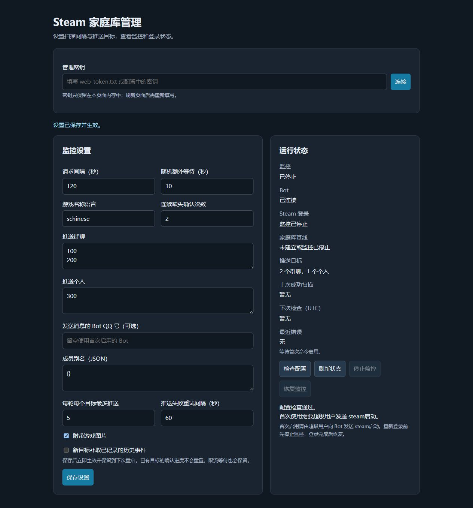

# NoneBot Plugin Steam Family Watchdog

监控 Steam 家庭库变化，将新增游戏或新增拥有者推送至 QQ 群和个人的 **NoneBot2 / OneBot v11 插件**。

自动刷新steam凭证、无需维护；支持独立目标确认进度、长期凭据失效通知，以及轻量 Web 管理页面。

## 需要什么

Python 3.11+、NoneBot2 2.5+、OneBot v11、Steam 家庭账号。

## 安装和加载

一、一键安装(推荐):

```bash
nb plugin install nonebot-plugin-steam-family-watchdog
```

二、使用源码在 **Bot 使用的 Python 环境**中安装。

```bash
git clone https://github.com/tianyisama/nonebot_plugin_steam_family_watchdog.git
cd nonebot_plugin_steam_family_watchdog
python -m pip install .
```

也可直接从 GitHub 安装：

```bash
python -m pip install "git+https://github.com/tianyisama/nonebot_plugin_steam_family_watchdog.git"
```


在现有 NoneBot 入口中，完成 `nonebot.init()` 和 OneBot v11 Adapter 注册后加载：

```python
nonebot.load_plugin("nonebot_plugin_steam_family_watchdog")
```

使用 `nb run` 的项目，也可在项目 `pyproject.toml` 的 `[tool.nonebot]` 中把 `nonebot_plugin_steam_family_watchdog` 加入 `plugins`。


## 配置

把 `.env.example` 的配置合并到 Bot 的 `.env` / `.env.prod`，替换示例中的 QQ 号：

```dotenv
SUPERUSERS=["123456789"]
STEAM_FAMILY_DATA_DIR="data/steam_family_watchdog"
STEAM_FAMILY_PUSH_GROUPS=["987654321","987654322"]
STEAM_FAMILY_PUSH_USERS=["123456789"]
STEAM_FAMILY_POLL_SECONDS=300
STEAM_FAMILY_JITTER_SECONDS=10
STEAM_FAMILY_LANGUAGE="schinese"
STEAM_FAMILY_WEB_ENABLED=true
STEAM_FAMILY_WEB_HOST="0.0.0.0"
STEAM_FAMILY_WEB_PORT=11454
```

群聊、个人均为 **list**，可以任意一项为空，但启用时不能同时为空。支持数字或数字字符串。数据目录相对 **Bot 的工作目录**解析。

| 配置名（`STEAM_FAMILY_` 前缀） | 默认值 | 用途 |
|---|---|---|
| `DATA_DIR` | `data/steam_family_watchdog` | 凭据、库存、事件、插件配置和状态 |
| `POLL_SECONDS` | `300` | Steam 请求间隔，60～86400 秒 |
| `JITTER_SECONDS` | `10` | 额外随机等待 0～300 秒 |
| `LANGUAGE` | `schinese` | Steam 游戏名称语言 |
| `MISSING_CONFIRMATIONS` | `2` | 连续缺失确认次数，1～10 |
| `MEMBER_ALIASES` | `{}` | SteamID64 → 显示名称 |
| `PUSH_GROUPS` | `[]` | 推送群号列表 |
| `PUSH_USERS` | `[]` | 推送个人 QQ 号列表 |
| `BOT_ID` | 空 | 多 Bot 时指定发送方；留空绑定首次启用的 Bot |
| `SEND_IMAGES` | `true` | 变化消息附带游戏图片 |
| `REPLAY_HISTORY` | `false` | 新推送目标是否补取已有事件 |
| `MAX_PUSH_PER_TICK` | `5` | 每轮每个目标最多推送事件数，1～50 |
| `PUSH_RETRY_SECONDS` | `60` | 发送失败后的重试间隔，10～3600 秒 |
| `WEB_ENABLED` | `true` | 是否启用管理页面 |
| `WEB_HOST` | `0.0.0.0` | 管理服务监听地址 |
| `WEB_PORT` | `11454` | 管理服务端口 |
| `WEB_TOKEN` | 空 | 至少 32 字符；留空自动生成本地密钥文件 |


NoneBot 的 dotenv 配置在启动时读取。Web 修改保存在 `DATA_DIR/plugin-config.json`，并在以后启动时覆盖对应 dotenv 设置；页面保存的是完整可编辑配置。若希望以 `.env` 为准，停止 Bot 后删除 `plugin-config.json`即可。

Web 监听地址、端口、数据目录、管理密钥属于启动配置，修改 `.env` 后需要重启应用。推送目标、轮询参数、语言、别名和图片选项可在页面中实时修改。

## Steam 登录

插件读取 `DATA_DIR/auth.json`。在 **Bot 的工作目录**执行下列命令，直接将凭据保存到默认插件数据目录：

```bash
python -m steam_family_watchdog_core setup --root ./steam-login
python -m steam_family_watchdog_core login --root ./steam-login --data-dir ./data/steam_family_watchdog
```

在运行登录程序的电脑上访问 `http://127.0.0.1:11453`。支持账号密码、Steam++ / Watt Toolkit / 手机 App 动态验证码和邮箱验证码。密码、验证码不会保存；成功后约 10 秒退出登录服务。

扫码登录可替换第二条命令为：

```bash
python -m steam_family_watchdog_core login-qr --root ./steam-login --data-dir ./data/steam_family_watchdog
```

如果修改了 `STEAM_FAMILY_DATA_DIR`，请把 `--data-dir` 改成相同路径。登录程序与运行中的监控不能同时使用该数据目录，重新登录前需先发送 `/steam停止`。

`steam-login` 仅保存登录工具自身的配置和随机接口密钥，其 `MONITOR_API_SECRET` 不用于插件 Web 管理。

如已有 JS / Python 版 `steam-family-watchdog` 数据，停止原监控后，可将整个 `data` 目录复制到插件数据目录，或直接设置 `STEAM_FAMILY_DATA_DIR` 为其绝对路径。`auth.json` 和 SQLite 表结构保持兼容，原有事件及 HTTP 客户端进度不会重置。新的 QQ 目标是否补取历史由 `REPLAY_HISTORY` 决定。

`--root` 指定工具配置目录，`--data-dir` 指定实际凭据 / 数据目录（相对于当前工作目录解析）。

## 首次启用、自动恢复和命令

第一次加载插件会启动管理页面和调度器，但不请求 Steam、不推送历史库。由超级用户向 Bot 发送：

```text
/steam检查
/steam启动
```

命令前缀遵循 Bot 的 `COMMAND_START` 配置；如果 Bot 允许无前缀，也可直接发送 `steam启动`。

`steam启动` 会检查本地配置、至少一个推送目标、SUPERUSERS、Bot 连接 / ID 和长期凭据格式及到期时间。通过后保存首次启用标记与启用状态，后端由 APScheduler 开始扫描。

**以后重启自动恢复已保存的状态**：已启用则自动装配后端并恢复扫描；已停止则保持停止。没有额外的手动启动脚本，也不用每次重新唤醒。

| 超级用户命令 | 用途 |
|---|---|
| `steam启动` / `steam启用` | 首次启用或恢复监控 |
| `steam停止` / `steam停用` | 停止监控、落盘停用状态、释放数据锁 |
| `steam检查` | 本地配置及凭据检查，不触发 Steam 请求 |
| `steam状态` | 启用状态、Bot / Steam 状态、基线、扫描时间及错误 |

检查通过不代表 Steam 在线接口已成功；家庭成员资格、网络和目标消息送达以实际扫描 / 推送结果为准，可通过状态查看。

## 推送与失效通知

每个群和个人使用自己的 SQLite 客户端游标，`nonebot:group:群号` / `nonebot:private:QQ号`。发送成功才 ACK；发送失败保留该目标的批次并等待重试，其他目标继续处理。游标和待投递批次跨重启保存。

默认首次扫描建立静默基线。新目标默认从当前最新事件开始；`REPLAY_HISTORY=true` 则新目标补取全部已记录事件。已有目标的游标不会因重复启用、改配置或切换该选项而重置。暂停某个目标可暂时把它从列表移除，再加入时仍继续原有进度。

推送包括游戏名称、新增拥有者、北京时间发现时间、Steam 商店链接及可选图片；新增拥有者与新增游戏分别显示。新成员带来的变化会说明来源，避免把家庭库变化直接称为购买。

Steam access token 自动刷新，refresh token 临近到期时自动尝试续期。长期凭据过期、被撤销或拒绝使用时：

1. 保留基线及未处理事件，并进入核心已有的认证退避。
2. 私聊通知所有适用的 SUPERUSERS；Bot 未连接或通知失败时，保留待通知状态并重试。
3. 同一凭据失效不每轮重发；已通知名单落盘，重启也不重复轰炸。恢复成功后解除告警，新一轮失效可以再次通知。

收到通知后，先发送 `steam停止`，再完成登录并更新 `auth.json`，随后 `steam启动` 或通过管理页面恢复。Web 和命令仍保持可用。

无法登录 Bot 的群或私聊会保留待处理批次；发送权限、好友关系以及 OneBot 实现的图片能力仍由实际 Bot 环境决定。发送与本地 ACK 之间如果进程崩溃，恢复后可能重复发送那条消息，投递语义为“至少一次”。

## 轻量管理 Web

默认地址为 `http://服务器IP:11454`（本机为 `http://127.0.0.1:11454`）。仅使用已有 `aiohttp`，没有额外前端框架、数据库或独立进程。

<details>
<summary>查看管理页面预览（模拟数据）</summary>



</details>

管理页面需要填写密钥：

- 设置 `STEAM_FAMILY_WEB_TOKEN` 时使用该值。
- 留空则从 `DATA_DIR/web-token.txt` 读取自动生成的密钥。

密钥不嵌入网页、不通过 Bot 消息发送，也不在配置 API 中返回。浏览器只在当前页面内存中保存密钥，刷新页面后需要重新输入。

页面支持修改扫描参数、目标列表、语言、成员别名和图片设置，检查配置，查看状态，以及停止 / 恢复监控。**首次启用必须通过 Bot 的超级用户命令**；Web 恢复按钮不会绕过这一要求。

所有管理 API 都需要 `Authorization: Bearer 管理密钥`，JSON 请求体最多 32 KB。未知配置项、非法参数和跨站请求会被拒绝。

| 方法 | 地址 | 用途 |
|---|---|---|
| GET | `/` | 管理界面，不包含密钥或运行配置 |
| GET | `/api/config` | 可编辑配置，不返回秘密字段 |
| PATCH | `/api/config` | 校验、原子落盘并应用配置 |
| GET | `/api/status` | 运行状态 |
| POST | `/api/check` | 离线检查，JSON `{}` |
| POST | `/api/stop` | 停止，JSON `{}` |
| POST | `/api/resume` | 恢复已首次启用的监控，JSON `{}` |

监听 `0.0.0.0` 意味着其他设备可访问；建议在自己的局域网 / VPN 内使用，跨公网访问则通过 HTTPS 反向代理保护管理密钥。端口被占用时，记录 Web 启动错误，Bot 监控和命令仍可使用。

## 数据文件与生命周期

数据目录中包含：

```text
auth.json               Steam 长期凭据
monitor.sqlite3         原版兼容的库存、事件、客户端进度
plugin-config.json      Web 保存的运行配置覆盖
plugin-state.json       首次启用、停用状态、选定 Bot、失效通知记录
web-token.txt           未显式配置时生成的管理密钥
monitor.lock            监控运行期间的核心实例锁
.plugin/monitor.lock    NoneBot 插件生命周期的实例锁
```

停止监控会释放核心锁，插件自己的锁和管理页面继续工作。关闭 NoneBot 则移除调度任务，等待正在执行的扫描 / 推送结束，关闭 HTTP 和 Steam 连接、SQLite，再释放插件锁。避免多 worker 启动同一数据目录；后续实例会拒绝占用，保护推送进度。

APScheduler 每 5 秒唤起一次控制任务，**不会每 5 秒请求 Steam**。实际请求由 `POLL_SECONDS`、随机等待以及核心限流 / 认证 / 网络退避共同决定。保存配置和 Bot 请求均不会绕过已有失败暂停。

## 项目结构

```text
src/nonebot_plugin_steam_family_watchdog/
    __init__.py   NoneBot 入口、hook、APScheduler、命令与权限
    config.py     配置类、校验及 Web 可编辑字段
    service.py    内置后端、持久启用、目标投递与失效告警
    messages.py   OneBot 消息与 SUPERUSERS ID 解析
    web.py        轻量管理服务及鉴权
    web.html      管理页面
src/steam_family_watchdog_core/
    ...           内置 Steam 认证、SQLite、轮询及登录工具
tests/
    core/         核心功能测试
    ...           插件、NoneBot 生命周期和 Web 测试
```

## 测试与验证范围

```powershell
python -W error -m unittest discover -s tests -t . -v
```

测试使用模拟 Steam / Bot 和本地 HTTP 服务，覆盖真实 NoneBot 生命周期、APScheduler 调度、OneBot 超级用户权限、dotenv list 解析、首次启用限制、重启恢复、目标间隔离、失败重试、凭据过期通知去重、限流保留、Web 鉴权和参数热更新。

真实 Steam 账号登录、QQ 连接与群 / 私聊端到端发送尚未实测。CI 配置会在 Windows / Linux 和 Python 3.11 / 3.14 上执行测试；本地已使用 Windows / Python 3.14 验证。

## 更新

停止 Bot 后，在源码目录执行：

```bash
git pull
python -m pip install --upgrade .
```

随后重新启动 Bot。

## 来源与许可证

监控核心由 [steam-family-watchdog](https://github.com/tianyisama/steam-family-watchdog) 的 JavaScript 实现移植为 Python，保留静默基线、库存验证、持久事件、独立客户端 ACK 和限流退避行为。Steam 认证协议参考 [steam-session](https://github.com/DoctorMcKay/node-steam-session) 及 [Steam protobuf 定义](https://github.com/SteamTracking/Protobufs/blob/master/steam/steammessages_auth.steamclient.proto)。

接入方式参考当前 [NoneBot 定时任务文档](https://nonebot.dev/docs/best-practice/scheduler)、[配置文档](https://nonebot.dev/docs/appendices/config)、[Driver hook API](https://nonebot.dev/docs/api/drivers) 及 [OneBot v11 消息 API](https://onebot.adapters.nonebot.dev/docs/api/v11/bot/)。许可证沿用原项目 MIT。
